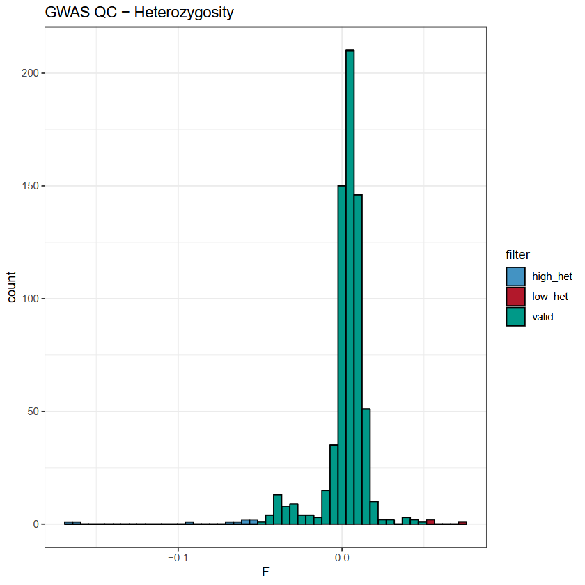
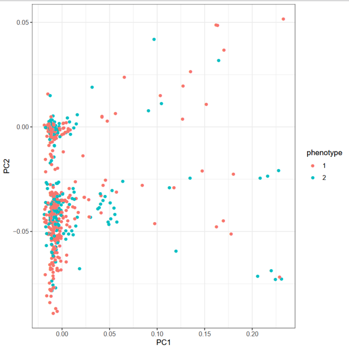

# HCL-GWAS

## Introduction

This Nextflow pipeline is designed to perform Genome Wide Association Studies (GWAS) and Rare Variants Association Tests (RVAT). This ReadMe contains step-by-step instructions to configure and run the pipeline.

This pipeline uses Pink to perform QC and SAIGE to perform the association tests. It includes:
 
 - GWAS and Rare Variants Association Tests for Binary or Continuous traits

 - Inclusion of variants on chrX

 - Generation of logs and plots for the different steps of the pipeline (PCA, Manhattan, QQplot...)

## Table of Contents

1. [Introduction](#introduction)
2. [Table of Contents](#table-of-contents)
3. [Dependencies](#dependencies)
4. [The Pipeline](#the-pipeline)
    - [Input data and config](#input-data-and-config)
5. [Step-by-step tutorial](#step-by-step-tutorial)    
    - [Quality Control](#quality-control)
    - [Admixture](#admixture)
    - [GWAS association](#gwas-association)
    - [Rare Variants Association Tests ](#rare-variants-association-tests)
6. [List of config parameters](#list-of-config-parameters)

## Dependencies

The following tools need to be installed on your machine: 

 - [plink v1.9](https://www.cog-genomics.org/plink/1.9/)

 - [R](https://cran.r-project.org/) (and the R packages 'optparse', 'qqman' and 'ggplot2')

 - [SAIGE](https://saigegit.github.io/SAIGE-doc/)

All dependencies are available inside a Apptainer (or Singularity) image, that can be build from the recipe provided within this repository [HCL-GWAS.def](./HCL-GWAS.def):

```shell
# Using singularity:
singularity build HCL-GWAS.sif HCL-GWAS.def

# Using apptainer:
apptainer build HCL-GWAS.sif HCL-GWAS.def
```

*Note: The scripts were developed and tested on Linux (Debian release 11) using nextflow v22.04.5 and R v4.4.1*

## The Pipeline

The pipeline can be launched from [HCL-GWAS.nf](./HCL-GWAS.nf).

You will need to change values in the configuration file [default.conf](./confs/default.conf) to adjust the QC and association steps to fit your own study.

### Input data and config

#### Genotypes:

To run this pipeline you will need genotyping data in the *plink* format:
 
 - [.bed](https://www.cog-genomics.org/plink/1.9/formats#bed): file representing the genotype calls. Must be accompanied by .bim and .fam formats.

 - [.bim](https://www.cog-genomics.org/plink/1.9/formats#bim): file listing the variants (position and alleles).
  
 - [.fam](https://www.cog-genomics.org/plink/1.9/formats#fam): file with the samples information (ID, family IDs, sex and phenotype).

More information about the formats can be found in the Plink documentation: https://www.cog-genomics.org/plink/1.9/formats.

#### Covariates:

You will also need a tab-delimited [covariates file](https://www.cog-genomics.org/plink/1.9/input#covar) which **must** have the *FID* and *IID* columns and a header line.

```
FID    IID    AGE    SEXE    MUT1    TABAC   PC1     PC2     PC3     PC4     PC5
C123   D001   34     1       2       0       -0.118  0.249   0.053   0.090   0.001
C123   D002   67     2       1       0       -0.119  0.257   0.061   0.088   -0.004
C321   D003   84     1       1       1       -0.120  0.249   0.056   0.094   -0.001
...
```

Do not forget to specify the *covar_file* (path to the covariates file), *saige_covar* (names of **all** covariates to take into account in the association model) and *saige_qcovar* (list of quantitative covariables) parameters in the config file. 

#### Exclusion

If some samples need to be removed from the entire analysis, you can create a tab-delimited file listing their *FIDs* and *IIDs*:

```
FID    IID
C123   D001
C123   D002
```

and assign the path to this file as the value to *qc_remove* in the config file. Keep *qc_remove = ""* if you do not wish to filter any individual.

#### Heterozygosity filter

Individuals with extreme heterozygosity levels are usually removed from GWAS analyses, to avoid biases due to consanguinity (low het. levels) and library preparation (high het. levels.). 

In HCL-GWAS, samples outside 3 standard deviations for the cohort's mean can be removed from the analysis, depending on the value set for *qc_hetfilter*:

```
    - 'none': do not apply the heterozygosity filter.
    - 'low':  remove individuals with a F coefficient > 3 SDs from the cohort's mean.
    - 'high': remove individuals with a F coefficient < 3 SDs from the cohort's mean.
    - 'both': applies both of the above.
```
    
*Note*: the F coefficient is inversely correlated with heterozygosity (so a 'high' heterozygosity corresponds to a low F value).*

*Note*: if you have admixed samples in your cohort, they will have a very low F coefficient and you should consider wether or not to remove them from the analysis, as the high heterozygosity is then expected and is not reflective of a low quality library.

## Step-by-step tutorial

### Quality Control

#### Preparation of the output files

The first step is to preprocess the genotype data:

 - Missing rsids ".", will be replaced with automatic IDs using the following format: "chr_pos_ref_alt".

 - If not present, the PAR regions for chrX and chrY will be split into a separate chromosome (option *--split-x* from plink). This will allow the tools to treat it as an autosome during the association tests.

 - Variants on chrX (non-par) will be doubled for males. This reduces the type 1 error especially if there is an imbalance between males and females in the cohort ([Özbek et al.](https://doi.org/10.1002/gepi.22132)).

#### Base QC on the genotype data:

The first step performs standard GWAS quality control:

 - Remove individuals with >5% missing genotypes (the threshold can be changed with *qc_mind*)

 - Remove variants with >5% missing genotypes (the threshold can be changed with *qc_geno*)

 - Remove individuals listed in the file designed by [qc_remove](#exclusion)

 - Remove individuals with [extreme heterozygosity](#heterozygosity-filter)

 - Produce the eigenvectors and eigenvalues of the [genomic PCA](#principal-component-analysis)

 - For the GWAS: remove variants with a MAF < *gwas_maf*

This pipeline will output the following:

 - logs/: folder containing various logs created during the QC steps.

 - QC/:
    - **\<basename\>_QCed.{bim,bed,fam}**: contains the QCed genotype data
    - **\<basename\>_QCed_pruned.{bim,bed,fam}**: contains the *pruned* QCed genotype data
    - **\<basename\>_baseQCed.eigenvec**: contains the PCA components
    - **\<basename\>_baseQC.het.nonvalides**: contains the samples not passing the heterozygosity filtering

 - plots/:
    - **\<basename\>_baseQC.het.pdf**: plot of the F coefficient distribution (see [Heterozygosity plot](#heterozygosity-plot))
    - **\<basename\>_baseQCed_PCA.pdf**: plot of the PCA (see: [Principal Component Analysis](#principal-component-analysis))

#### Heterozygosity plot:

This plots shows the distribution of the F coefficient in the cohort. The F coefficient reports the observed and expected autosomal homozygous genotype counts for each sample. A low F value corresponds to a high heterozygosity and a high F value corresponds to a low heterozygosity and there are plotted in red and blue respectively in the plot. In HCL-GWAS.nf you can choose to remove 'none' samples, or those with 'low' heterozygosity, 'high' heterozygosity or 'both' (see [heterozygosity filter](#heterozygosity-filter)).



#### Principal Component Analysis

HCL-GWAS plots the PCA obtained with the [*--pca* option](https://www.cog-genomics.org/plink/1.9/strat#pca) from plink. The PCA is built from the variance-standardized relationship matrix (GRM) and the components are written to a *.eigenvec* file.

This plot can help you to find patterns in the genetic relationship between individuals in your cohort, notably regarding ancestry. The principal components are usually given as covariates to the GWAS to account for ancestry in the association models.



HCL-GWAS outputs two PCA plots: one colored with the phenotype the other with sex.

#### QQplot

### Admixture

(Alexander et al., [2009](https://pmc.ncbi.nlm.nih.gov/articles/PMC2752134/)).

### GWAS association 

The GWAS is performed with SAIGE-GENE+. First a null model, only considering the covariates impact on the phenotype, is fitted. Then the association is performed on the full model (including genotypes).

The results are available under: 
 
 - **saige\<basename\>_saige.single_variant.tsv**

### Rare Variants Association Tests 

The RVAT is performed with SAIGE-GENE+. First, variants are grouped into genes using *glist-hg19* or *glist-hg38* depending on the value of [genome_build](#list-of-config-parameters).

As for the GWAS, a null model, only taking into account the covariates is fitted. Then each region is tested with the following masks:

    - Removing variants with a MAF > 0.001
    - Removing variants with a MAF > 0.01
    - Removing variants with a MAF > 0.1

Masks on the variants annotation will be implemented soon.

## List of config parameters

The table below describe all the parameters available in the config file, with their default values.

| Param | Description | Default |
| | | |
| plink\_fileset | Path to the plink fileset (.bim, .bed, .fam). Format: '/path/to/example.{bed,bim,fam}' | "" |
| covar\_file | Path to the covar file (tab delimited, needs a header and FID and IID columns) | "" |
| outdir | Path to the output folder | ${launchDir} |
| genome\_build | The genome build ("hg19" or "hg38") | "hg19" |
| trait\_type | The type of the trait under study ("binary" or "quantitative") | "binary" |
| | | |
| qc\_mind | Individuals with missing genotypes > 'qc\_mind' will be removed | 0.05 |
| qc\_geno | Variants with missing genotypes > 'qc\_geno' will be removed | 0.05 |
| qc\_remove | (optional) Path to the file containing individuals to remove (should contain FIDs and IIDs) | "" |
| qc\_hetfilter | Filter to apply to remove individuals with extreme heterozygosity ("none", "both", "high" or "low"). Eg: "low" will remove individuals with extremely low heterozygosity (<3 SDs from the mean) | "both" |
| qc\_hwe | pvalue threshold for the Hardy Weinberg Equilibrium exact test. Variants with a p-value < 'qc\_hwe' will be written to a file for further inspection | "5e-6" |
| | | |
| pr\_window | Window size for the variant pruning step (in number of variants) | 200 |
| pr\_step | Window sliding size for the variant pruning step (in number of variants) | 50 |
| pr\_r2 | r2 threshold for the pruning, variants with r2 > 'pr\_r2' in a window will be removed | 0.25 |
| | | |
| gwas\_maf | MAF threshold for the GWAS analysis. Variants with a MAF < 'gwas\_maf' will NOT be considered | 0.01 |
| | | |
| saige\_covar | Name of the covariates to include in SAIGE model, should correspond to columns in 'covar\_file'. | "" |
| saige\_qcovar | Name of the covariates which are categorical. | "" |
| saige\_extension | When assigning variants to gene for the RVAT, adds this number of kbp to extend the genes | 5 |
